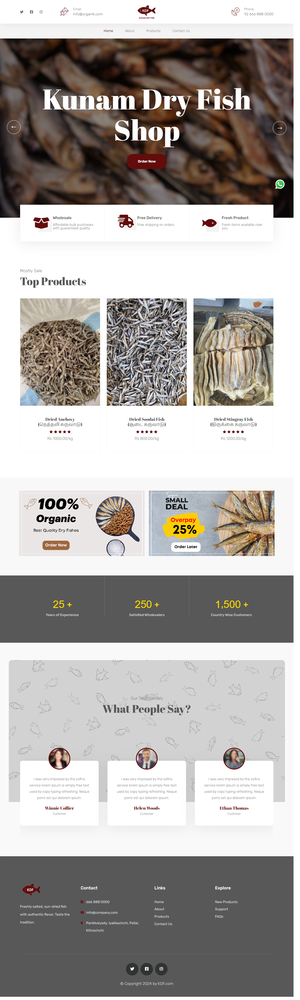
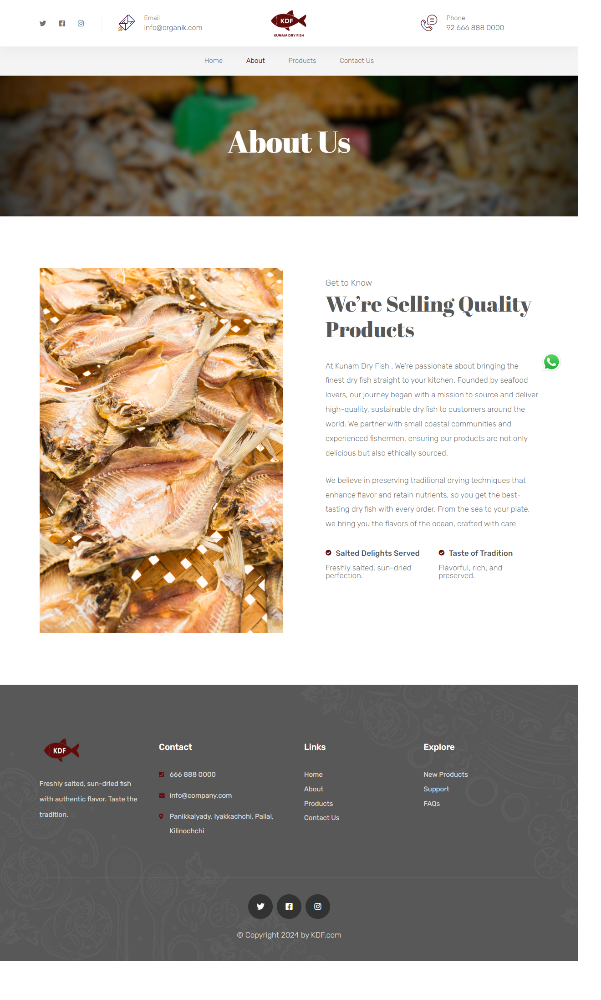
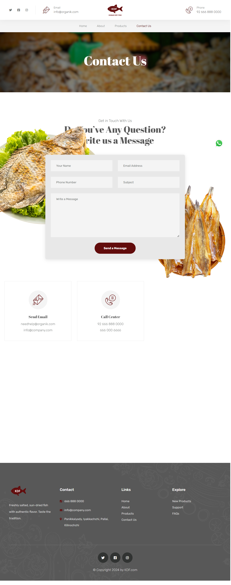

# Kunam Dry Fish Shop - Online Web Page

## Overview

Kunam Dry Fish Shop is an online platform designed to showcase and sell fresh, high-quality dry fish products.  
The goal is to provide a simple, user-friendly website to attract and inform customers about available products.

---

## Features

- **Home Page**: Displays a welcoming introduction and highlights products.
- **Product Listing**: Showcases a variety of dry fish with descriptions and images.
- **Contact Us**: Providing information about Kunam Dry Fish Shop.
- **Contact Us**: Provides a form for inquiries and shop location details.
- **Responsive Design**: Optimized for both mobile and desktop viewing.

---

## Screenshots

### Home Page

  
_A clean and vibrant landing page showcasing shop highlights._

### Product Listing

  
_A section displaying products with prices and descriptions._

### About Page

  
_A section providing information about Kunam Dry Fish Shop, its history, values, and commitment to quality._

### Contact Us

  
_A form and location map for customer inquiries._

---

## Technologies Used

- **Frontend**: HTML, CSS, JavaScript

---

## How to View the Project

### Option 1: Online

- [Provide a live demo link if hosted, e.g., on GitHub Pages, Vercel, or Netlify]

### Option 2: Local

1. Clone the repository:
   ```bash
   git clone https://github.com/yourusername/kunam-dry-fish-shop.git
   ```
